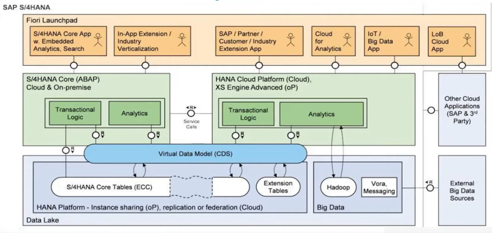
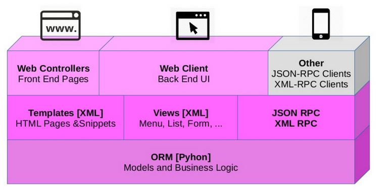

# Capítulos de la Memoria

## Introducción a los ERPs

Los sistemas ERP son soluciones diseñadas para centralizar e integrar los procesos empresariales clave, proporcionando una visión completa y unificada del flujo de actividades en toda la organización.

### Principales características de los ERPs
- **Integración de procesos:** Los ERPs conectan diferentes áreas de la empresa, como finanzas, logística, recursos humanos y ventas, asegurando que todos los datos estén sincronizados y disponibles en tiempo real.
- **Escalabilidad y modularidad:** Los sistemas ERP están diseñados para adaptarse al crecimiento empresarial, permitiendo la integración de nuevos módulos según las necesidades.
- **Automatización de tareas:** Automatizan procesos rutinarios, como la facturación, gestión de inventarios y seguimiento de pedidos, reduciendo errores humanos y optimizando tiempos.
- **Base de datos centralizada:** Toda la información se almacena en una única base de datos, lo que facilita el acceso a datos actualizados y mejora la toma de decisiones estratégicas.

### SAP como ERP de Referencia

SAP (Systems, Applications, and Products in Data Processing) es el ERP más utilizado a nivel mundial, ampliamente adoptado por grandes corporaciones gracias a su capacidad para manejar operaciones empresariales complejas, su integración modular profunda y su enfoque en estabilidad para cadenas de suministro y análisis global. Como solución privativa gestionada por SAP SE, requiere licencias cerradas, con costos aproximados de 2.700 € por usuario para licencias perpetuas (Professional) o suscripciones mensuales desde 91 € por usuario. Los costos de implementación oscilan entre 15.000 € y 60.000 €, dependiendo de la complejidad, con un mantenimiento anual del 15% del costo de las licencias.

# Arquitectura de SAP S/4HANA

```
SAP S/4HANA Architecture
├── Presentación (Frontend)
│   ├── SAP Fiori Launchpad
│   │   ├── Aplicaciones web responsivas
│   │   ├── Aplicaciones móviles
│   │   └── Diseño UX moderno
│   ├── SAP GUI (opcional)
│   │   ├── SAP GUI para Windows
│   │   ├── SAP GUI para Java
│   │   └── SAP GUI para HTML (Web GUI)
│   └── Integraciones con portales
│       └── Portales de clientes/proveedores
│
├── Lógica de Negocio (Backend)
│   ├── Módulos de Aplicaciones
│   │   ├── Finanzas (FI)
│   │   ├── Controlling (CO)
│   │   ├── Gestión de Materiales (MM)
│   │   ├── Ventas y Distribución (SD)
│   │   ├── Planificación de Producción (PP)
│   │   ├── Recursos Humanos (HR)
│   │   ├── Mantenimiento de Planta (PM)
│   │   └── Otros módulos (CRM, SCM, etc.)
│   ├── Lógica personalizada
│   │   ├── ABAP (Advanced Business Application Programming)
│   │   └── Extensiones (BAdIs, Enhancements, Exits)
│   ├── Gestión de procesos empresariales
│   │   ├── Workflows
│   │   ├── Reglas de negocio
│   │   └── Gestión de aprobaciones
│   └── Middleware de integración (SAP NetWeaver)
│       ├── SAP PI/PO (Process Integration/Orchestration)
│       ├── Web Services
│       ├── OData APIs
│       └── Conectores para sistemas externos
│
├── Datos (Persistencia)
│   ├── Base de datos
│   │   ├── SAP HANA (Base de datos en RAM)
│   │   └── Gestión de datos maestros
│   │       ├── Clientes
│   │       ├── Proveedores
│   │       └── Productos
│   ├── Repositorios de datos
│   │   ├── Archivos de configuración
│   │   ├── Reportes
│   │   └── Documentos adjuntos
│   └── Caching y aceleradores
│
├── API y Conectividad
│   ├── SAP Gateway
│   │   ├── OData Services
│   │   └── RESTful APIs
│   ├── Integraciones con sistemas externos
│   │   ├── EDI (Intercambio Electrónico de Datos)
│   │   ├── Conectores de terceros
│   │   ├── Plataformas de pago
│   │   └── Marketplaces
│   ├── IDocs (Intermediate Documents)
│   └── RFC (Remote Function Calls)
│
├── Framework Técnico
    ├── SAP NetWeaver
    │   ├── Motor de aplicaciones (ABAP y Java)
    │   ├── Portal empresarial
    │   ├── Gestión de usuarios y roles
    │   └── Integración de aplicaciones
    └──  Desarrollo
        ├── ABAP Workbench
        └──  Herramientas de Fiori/UI5
```
---

### Odoo como ERP OpenSource

Odoo es una solución ERP de código abierto diseñada para pequeñas, medianas y grandes empresas. Su arquitectura modular y flexibilidad lo convierten en una herramienta destacada en la gestión de recursos empresariales.

# Arquitectura de Odoo

```
Odoo 18 Architecture
├── Presentación (Frontend)
│   ├── Interfaz web renovada
│   │   ├── Formularios
│   │   ├── Vistas Kanban
│   │   ├── Vistas Calendario
│   │   └── Vistas Gráficas
│   ├── Portal del cliente mejorado
│   └── Diseño responsivo optimizado
├── Lógica de Negocio (Backend)
│   ├── Módulos de aplicaciones
│   │   ├── Ventas (Sales)
│   │   ├── Compras (Purchase)
│   │   ├── Inventario (Inventory)
│   │   ├── Contabilidad (Accounting)
│   │   ├── Recursos Humanos (HR)
│   │   └── Otros módulos (Marketing, eCommerce, etc.)
│   ├── Personalización y configuraciones
│   │   ├── Studio
│   │   ├── Configuraciones básicas
│   │   └── Flujo de trabajo dinámico
│   └── Motor ORM (Object-Relational Mapping)
│       ├── Modelos (Python)
│       ├── Relaciones (One2Many, Many2One, Many2Many)
│       └── Reglas de acceso
├── Datos (Persistencia)
│   ├── Base de datos PostgreSQL
│   │   ├── Modelos de datos (tablas)
│   │   ├── Datos transaccionales
│   │   ├── Usuarios y permisos
│   │   └── Backups
│   └── Caché de datos (opcional)
├── API y Conectividad
│   ├── API XML-RPC/JSON-RPC
│   ├── Integraciones externas
│   │   ├── Pasarelas de pago
│   │   ├── Plataformas de envío
│   │   ├── CRMs/ERPs externos
│   │   └── Servicios web
│   └── Extensiones a través de módulos
├── Framework Técnico
│   ├── Framework Odoo (OpenObject)
│   │   ├── Controladores
│   │   ├── Plantillas QWeb
│   │   ├── Reportes
│   │   └── Widgets JS
│   └── Herramientas de desarrollo
│       ├── Depuración
│       ├── Migración de datos
│       └── Actualización de módulos
└── Infraestructura
    ├── Servidor
    │   ├── Servidor web (Werkzeug)
    │   └── Servidor proxy (NGINX/Apache)
    ├── Almacenamiento
    │   ├── Archivos adjuntos
    │   ├── Imágenes
    │   └── Reportes generados
    ├── Contenedores/Docker (opcional)
    └── Escalabilidad
        ├── Clústeres de servidores
        └── Balanceadores de carga

```

### Módulos de Odoo
Odoo cuenta con más de 40 módulos principales que abarcan diversas áreas funcionales. A continuación, se enumeran los principales módulos y sus funcionalidades:

1. **Facturación:** Gestión de facturas, seguimiento de pagos y conciliaciones bancarias.
2. **CRM:** Seguimiento de relaciones con clientes, análisis de datos de ventas y automatización de procesos.
3. **Ventas:** Gestión de presupuestos, órdenes de venta y facturación.
4. **Compras:** Control del flujo de adquisiciones, desde solicitudes hasta la recepción de mercancías.
5. **Inventario:** Gestión detallada de existencias, control de movimientos logísticos y planificación de reabastecimiento.
6. **Fabricación:** Gestión de órdenes de producción, planificación de recursos y seguimiento de calidad.
7. **Proyectos:** Planificación, asignación de tareas y seguimiento del progreso en proyectos colaborativos.
8. **Recursos Humanos:** Gestión de nóminas, seguimiento de asistencias y manejo de contratos.
9. **Contabilidad:** Conciliaciones bancarias, informes contables adaptados a normativas locales y control de flujo de caja.
10. **Marketing por correo:** Automatización de campañas de correo electrónico y análisis de métricas.
11. **Redes Sociales:** Programación de publicaciones y análisis de rendimiento en plataformas sociales.
12. **Sitios Web:** Herramientas de diseño para la creación de portales web y landing pages.
13. **E-commerce:** Plataforma integrada para ventas en línea, con gestión de catálogos y análisis de ventas.
14. **Servicios:** Gestión de tickets, contratos de soporte y control de tiempos de servicio.
15. **Punto de Venta (POS):** Solución para ventas minoristas con integración en tiempo real al inventario.
16. **Gestión de flotas:** Seguimiento y control de vehículos empresariales.
17. **Gestión de calidad:** Control de calidad en procesos de fabricación.
18. **Gestión de mantenimiento:** Programación y registro de mantenimientos preventivos y correctivos.
19. **Aprobaciones:** Flujos de aprobación para procesos internos como presupuestos o solicitudes de compra.
20. **Firma electrónica:** Integración para la firma digital de documentos.
21. **Encuestas:** Creación y análisis de encuestas personalizadas.
22. **Eventos:** Gestión de eventos empresariales, desde la planificación hasta el análisis de asistencia.
23. **Gastos:** Registro y validación de gastos de empleados.
24. **Suscripciones:** Gestión de contratos recurrentes y facturación automática.
25. **eLearning:** Creación y distribución de cursos en línea.
26. **Gestión de documentos:** Almacenamiento y organización de archivos empresariales.
27. **Email Marketing:** Diseño y envío de campañas de correo masivo.
28. **Reclutamiento:** Publicación de ofertas laborales y seguimiento de candidatos.
29. **Presupuesto:** Planificación y control presupuestario.
30. **Gestión de turnos:** Organización y seguimiento de horarios de empleados.
31. **Alquiler:** Gestión de productos y servicios de alquiler.
32. **Limpieza:** Planificación y asignación de tareas de limpieza.
33. **Gestión de empleados:** Información centralizada de empleados, desde contratos hasta documentación personal.
34. **Live Chat:** Atención al cliente en tiempo real a través de chat en línea.
35. **Panel de control:** Visualización de métricas clave y reportes personalizados.
36. **Interlocutores:** Gestión de contactos y relaciones empresariales.
37. **Localización:** Módulos específicos para adaptaciones legales y fiscales por país.
38. **IoT:** Integración con dispositivos IoT para la automatización de procesos.
39. **Seguimiento de tiempo:** Registro y análisis del tiempo empleado en tareas y proyectos.
40. **Inventario avanzado:** Funcionalidades adicionales como códigos de barras y seguimiento por lotes/serie.

### Ventajas técnicas de Odoo para ingenieros de software
- **Código abierto:** Ofrece total transparencia y la posibilidad de modificar la base según los requerimientos específicos del proyecto.
- **APIs bien documentadas:** Facilita la integración con aplicaciones externas y el desarrollo de nuevas funcionalidades.
- **Framework modular:** Los desarrolladores pueden activar y desactivar módulos según las necesidades, garantizando un uso óptimo de recursos.
- **Lenguaje de programación:** Utiliza Python para la lógica de backend y XML para las vistas, proporcionando flexibilidad en el desarrollo.
- **Escalabilidad:** Permite alojar la solución en entornos locales, servidores dedicados o en la nube, según la capacidad requerida.

La comunidad activa de Odoo y su ecosistema de aplicaciones aseguran un soporte constante y recursos para adaptaciones específicas.

---

## Análisis de Aplicaciones Relacionadas

Un análisis de aplicaciones similares es crucial para comprender el estado actual del mercado y las soluciones existentes en el ámbito del marketing digital y redes sociales. Este capítulo presenta un estudio de herramientas y proyectos relevantes.

### Aplicaciones enfocadas en marketing para redes sociales
1. **Buffer:** Software para la planificación, programación y análisis de publicaciones en diversas plataformas sociales.
2. **Hootsuite:** Plataforma integral para la gestión y monitoreo de redes sociales en tiempo real.
3. **Later:** Herramienta especializada en la gestión visual de contenido, enfocada en plataformas como Instagram.

### Plataformas de contenido como TikTok
- **TikTok Analytics Tools:** Soluciones para el análisis detallado del rendimiento de contenido y campañas publicitarias en TikTok.
- **Video Editing Apps:** Aplicaciones que permiten a los creadores diseñar contenido atractivo con herramientas de edición avanzadas.

### Ejemplos en GitHub
- **Social Media Marketing Bots:** Repositorios que ofrecen scripts para automatizar tareas como publicación de contenido o respuesta a interacciones.
- **Data Analytics Dashboards:** Proyectos de análisis de datos que visualizan métricas clave para la evaluación de campañas de marketing.

Estos ejemplos, aunque no idénticos a la idea principal, ofrecen perspectivas valiosas para el diseño e implementación de soluciones innovadoras en el ámbito del marketing digital.
